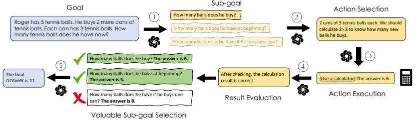

# Goal-oriented Prompt Engineering

*Fig.1 An overview of the goal-oriented framework for prompting LLMs taking solving a math word problem as an example. (1) Decomposing **goal** into **sub-goal** sequences. (2) **Action** selection for attaining **sub-goals**. (3) Executing **actions** to get **sub-goal results**. (4) Evaluating **sub-goal results**. (5) Further selection of valuable **sub-goals**. Note that stages (2)(3)(4) are taken for all the decomposed sub-goals.*

Large Language Models (LLMs) have shown prominent performance in various downstream tasks and prompt engineering plays a pivotal role in optimizing LLMs' performance. 
This paper, not only as an overview of current prompt engineering methods, but also aims to highlight the limitation of designing prompts based on an anthropomorphic assumption that expects LLMs to think like humans. 
From our review of 48 representative studies, we demonstrate that a goal-oriented prompt formulation, which guides LLMs to follow established human logical thinking, significantly improves the performance of LLMs. 
Furthermore, We introduce a novel taxonomy that categorizes goal-oriented prompting methods into five interconnected stages and we demonstrate the broad applicability of our framework. 
With four future directions proposed, we hope to further emphasize the power and potential of goal-oriented prompt engineering in all fields.  

This repository contains a curated list of datasets that are devoted to research 
on Goal-oriented Prompt Engineering. Our list covers a wide range of applications, including Arithmetic Reasoning,
Commonsense Reasoning, Symbolic Reasoning, Logical Reasoning, Planning in Virtual/Real Environment, Multihop Question Answering,
Open-domain Question Answering, Code Generation, Dialogue, and Recommendation.

Please feel free to send a pull request to add papers and relevant content that are not listed here.

## Content
- [Papers](#papers)
- [Tasks](#tasks)
  - [Arithmetic Reasoning](#arithmetic-reasoning)
  - [Commonsense Reasoning](#commonsense-reasoning)
  - [Symbolic Reasoning](#symbolic-reasoning)
  - [Logical Reasoning](#logical-reasoning)
  - [Planning](#planning)
  - [Multihop Question Answering](#multihop-question-answering)
  - [Open-domain Question Answering](#open-domain-question-answering)
  - [Code Generation](#code-generation)
  - [Dialogue](#dialogue)
  - [Recommendation](#recommendation)
  - [Misc](#misc)

## Papers

- [CoT](https://arxiv.org/pdf/2201.11903.pdf) - Chain of thought prompting elicits reasoning in large language models
- [Zero-shot Planner](https://arxiv.org/pdf/2201.07207.pdf) - Language models as zero-shot planners: Extracting actionable knowledge for embodied agents
- [Self-consistency](https://arxiv.org/pdf/2203.11171.pdf)  - Self-consistency improves chain of thought reasoning in language models
- [Least-to-most Prompting](https://arxiv.org/pdf/2205.10625.pdf)  - Least-to-most prompting enables complex reasoning in large language models
- [Selection-Inference](https://arxiv.org/pdf/2205.09712.pdf)  - Selection-inference: Exploiting large language models for interpretable logical reasoning
- [DecomP](https://arxiv.org/pdf/2210.02406.pdf)  - Decomposed prompting: A modular approach for solving complex tasks
- [Self-ask](https://arxiv.org/pdf/2210.03350.pdf)  - Measuring and narrowing the compositionality gap in language models
- [Zero-shot CoT](https://arxiv.org/pdf/2205.11916.pdf)  - Large Language Models are Zero-Shot Reasoners
- [Program of Thoughts](https://arxiv.org/pdf/2211.12588.pdf)  - Program of thoughts prompting: Disentangling computation from reasoning for numerical reasoning tasks
- [Successive Prompting](https://arxiv.org/pdf/2212.04902.pdf)  - Successive prompting for decomposing complex questions
- [Self-refine](https://arxiv.org/pdf/2303.17651.pdf)  - Self-refine: Iterative refinement with self-feedback
- [Reflexion](https://arxiv.org/pdf/2303.11366v4.pdf)  - Reflexion: an autonomous agent with dynamic memory and self-reflection
- [MCR](https://arxiv.org/pdf/2304.13007.pdf)  - Answering questions by meta-reasoning over multiple chains of thought
- [LLM+P](https://arxiv.org/pdf/2304.11477.pdf)  - Llm+p: Empowering large language models with optimal planning proficiency
- [PEARL](https://arxiv.org/pdf/2305.14564v1.pdf)  - PEARL: Prompting Large Language Models to Plan and Execute Actions Over Long Documents
- [Plan-and-solve](https://arxiv.org/pdf/2305.04091v3.pdf)  - Plan-and-solve prompting: Improving zero-shot chain-of-thought reasoning by large language models
- [ToT](https://arxiv.org/pdf/2305.10601.pdf)  - Tree of thoughts: Deliberate problem solving with large language models
- [Toolformer](https://arxiv.org/pdf/2302.04761.pdf)  - Toolformer: Language models can teach themselves to use tools
- [MWP](https://arxiv.org/pdf/2306.00784.pdf)  - Interpretable Math Word Problem Solution Generation Via Step-by-step Planning
- [ProCoT](https://arxiv.org/pdf/2305.13626.pdf)  - Prompting and Evaluating Large Language Models for Proactive Dialogues: Clarification, Target-guided, and Non-collaboration
- [GDP-Zero](https://arxiv.org/pdf/2305.13660.pdf)  - Prompt-Based Monte-Carlo Tree Search for Goal-Oriented Dialogue Policy Planning
- [Self-debug](https://arxiv.org/pdf/2304.05128.pdf)  - Teaching large language models to self-debug
- [SayPlan](https://arxiv.org/pdf/2307.06135.pdf)  - Sayplan: Grounding large language models using 3d scene graphs for scalable task planning
- [DEPS](https://arxiv.org/pdf/2302.01560.pdf)  - Describe, explain, plan and select: Interactive planning with large language models enables open-world multi-task agents
- [GITM](https://arxiv.org/pdf/2305.17144.pdf)  - Ghost in the minecraft: Generally capable agents for open-world enviroments via large language models with text-based knowledge and memory
- [Re-prompting](https://openreview.net/pdf?id=cMDMRBe1TKs)  - Planning with large language models via corrective re-prompting
- [HuggingGPT](https://arxiv.org/pdf/2303.17580.pdf)  - HuggingGPT: Solving ai tasks with ChatGPT and its friends in huggingface
- [Recmind](https://arxiv.org/pdf/2308.14296.pdf)  - Recmind: Large language model powered agent for recommendation
- [GoT](https://arxiv.org/pdf/2308.09687.pdf)  - Graph of thoughts: Solving elaborate problems with large language models
- [SALP](https://arxiv.org/pdf/2210.04964.pdf)  - Generating executable action plans with environmentally-aware language models
- [RAP](https://arxiv.org/pdf/2305.14992.pdf) - Reasoning with language model is planning with world model
- [SelfCheck](https://arxiv.org/pdf/2308.00436.pdf)  - SelfCheck: Using LLMs to zero-shot check their own step-by-step reasoning
- [RLP](https://arxiv.org/pdf/2305.12647.pdf)  - Reflective linguistic programming (rlp): A stepping stone in socially-aware agi (socialagi)
- [Inner Monologue](https://arxiv.org/pdf/2207.05608.pdf)  - Inner monologue: Embodied reasoning through planning with language models
- [LLM-Planner](https://arxiv.org/pdf/2212.04088.pdf)  - LLM-Planner: Few-shot grounded planning for embodied agents with large language models
- [INTERVENOR](https://arxiv.org/pdf/2311.09868.pdf)  - INTERVENOR: Prompting the Coding Ability of Large Language Models with the Interactive Chain of Repair
- [DOKE](https://arxiv.org/pdf/2311.10779) - Knowledge Plugins: Enhancing Large Language Models for Domain-Specific Recommendations
- [InteRecAgent](https://arxiv.org/pdf/2308.16505) - Recommender AI Agent: Integrating Large Language Models for Interactive Recommendations
- [Faithful CoT](https://arxiv.org/pdf/2301.13379) - Faithful Chain-of-Thought Reasoning
- [RoT](https://arxiv.org/pdf/2306.06891) - Recursion of Thought: A Divide-and-Conquer Approach to Multi-Context Reasoning with Language Models
- [MathPrompter](https://arxiv.org/pdf/2303.05398) - MathPrompter: Mathematical Reasoning using Large Language Models
- [PAL](https://arxiv.org/pdf/2211.10435) - PAL: Program-aided Language Models
- [LINC](https://aclanthology.org/2023.emnlp-main.313.pdf) - LINC: A Neurosymbolic Approach for Logical Reasoning by Combining Language Models with First-Order Logic Provers
- [Logical-LM](https://arxiv.org/pdf/2305.12295) - Logic-LM: Empowering Large Language Models with Symbolic Solvers for Faithful Logical Reasoning
- [REFINER](https://arxiv.org/pdf/2304.01904) - REFINER: Reasoning Feedback on Intermediate Representations
- [CRITIC](https://arxiv.org/pdf/2305.11738) - CRITIC: Large Language Models Can Self-Correct with Tool-Interactive Critiquing
- [Verify-and-Edit](https://arxiv.org/pdf/2305.03268) - Verify-and-Edit: A Knowledge-Enhanced Chain-of-Thought Framework
- [MAF](https://aclanthology.org/2023.emnlp-main.407.pdf) - MAF: Multi-Aspect Feedback for Improving Reasoning in Large Language Models

## Tasks

### Arithmetic Reasoning

- [GSM8K](https://arxiv.org/pdf/2110.14168v2.pdf) - Training Verifiers to Solve Math Word Problems
- [SVAMP](https://arxiv.org/pdf/2103.07191v2.pdf) - Are NLP Models really able to Solve Simple Math Word Problems?
- [ASDiv](https://arxiv.org/ftp/arxiv/papers/2106/2106.15772.pdf) - A Diverse Corpus for Evaluating and Developing English Math Word Problem Solvers
- [AQuA](https://arxiv.org/pdf/1705.04146v3.pdf) - Program Induction by Rationale Generation : Learning to Solve and Explain Algebraic Word Problems
- [MAWPS](https://aclanthology.org/N16-1136.pdf) - MAWPS: A Math Word Problem Repository
- [AddSub](https://aclanthology.org/D14-1058.pdf) - Learning to solve arithmetic word problems with verb categorization
- [MultiArith](https://arxiv.org/pdf/1608.01413.pdf) - Solving general arithmetic word problems
- [DROP](https://arxiv.org/pdf/1903.00161v2.pdf) - DROP: A Reading Comprehension Benchmark Requiring Discrete Reasoning Over Paragraphs
- [TabMWP](https://arxiv.org/pdf/2209.14610.pdf) - Dynamic prompt learning via policy gradient for semi-structured mathematical reasoning
- [FinQA](https://arxiv.org/pdf/2109.00122v3.pdf) - FinQA: A Dataset of Numerical Reasoning over Financial Data
- [ConvFinQA](https://arxiv.org/pdf/2210.03849v1.pdf) - ConvFinQA: Exploring the Chain of Numerical Reasoning in Conversational Finance Question Answering
- [TATQA](https://arxiv.org/pdf/2105.07624v2.pdf) - TAT-QA: A Question Answering Benchmark on a Hybrid of Tabular and Textual Content in Finance
- [SingleEq](https://watermark.silverchair.com/tacl_a_00160.pdf?token=AQECAHi208BE49Ooan9kkhW_Ercy7Dm3ZL_9Cf3qfKAc485ysgAAA0cwggNDBgkqhkiG9w0BBwagggM0MIIDMAIBADCCAykGCSqGSIb3DQEHATAeBglghkgBZQMEAS4wEQQMOQcE6oNFW0uiUPaNAgEQgIIC-jVZlsoGZOy26TzKYwxV1QCYYby2YJb6GmRt6vl7w9PLYyUcfds620TUi9vdNBeuoOtZtd4hKbYNWGUkGEaVxa94Jwuf0bekFyIKtrFa4zKrbe2-z7-qPfZJFP_0R_easQAPIAXheONAfIFsCLB6WAVgo875T7fdXl6EDEknv1yo7fGomDhHqG1mldAMRa6lpOZY_iepAkBSr6ZitbVdLOeNmHaJD2-2PWbino0vGfKWPr9v0U9VY6lhXfyLMN6n2UN_y1t5wMuaPh5lrAZOU8SwzRUhZh-nB3Q9i6hdnLijgbnprBYnpr3T_4nhAvUF1aS0cDF7VBWZ-e_vUrMMmVDmODUPQDWMyfS0wYY7oOv9nMsmM6dKJkI_3QRxYZkL-5-upRWXDtKtGtIHoxWdU2E1FGClONce4ozfTO7MkeN_ONyCYFVkx6tsh1lch8PtCFPbBSytuJn8xQzQZeaqE2n8RV7ZHKGg3v4M4szXOgPhfti0Yjp-eFGNMzme0JvJTvgUwal9h0sndaZXyhPiG7-bwKbsyPy9Q0WPMCx4liP_G3I_P1CFY9pi409kv0zYxxVkvW0X5p10e56gkdqBb9WVekkptCeGStC6buFqhc9aDITEXISDac3O5UrN5Mn5VoB-dNp8qDF3VYOpOkakLtAgADNzlB_rwALubLvvgGxhm1hVpuwWDY69QM8X9XCWIa1eepgsBjD01RO-HFlC18QYJFpFx4tv-TFiS_iHgcQcsHid1PgOIT-psmrI1bWDp5jYYaYsS0exqTtaCgAFdj0lWomiXVgUPbikXFKVjrxmf2eriXNmBltoqVFSEhrab_hCqeUEJzppg6Y0wSQPSXp6Fq-zP-Jt3TL1KETJwtq1982P5vG3rcwz57uBWahfqjBU5SqYRVCDU_64UwERwhJtWLLVU5mWbi0KZHGIQpXkNzKUPvk0wB7uOxqtGVGU8Nk3-PskTMTK2kvjUnomoRh0OVwKcgeLgI2LPKvzYwOdYBi4BLo-4a9GGg) - Parsing algebraic word problems into equations
- [MathQA](https://arxiv.org/pdf/1905.13319v1.pdf) - MathQA: Towards Interpretable Math Word Problem Solving with Operation-Based Formalisms
- [Game of 24](https://arxiv.org/pdf/2305.10601.pdf) - Tree of thoughts: Deliberate problem solving with large language models

### Commonsense Reasoning

- [CommonsenseQA](https://arxiv.org/pdf/1811.00937v2.pdf) - CommonsenseQA: A Question Answering Challenge Targeting Commonsense Knowledge
- [StrategyQA](https://arxiv.org/pdf/2101.02235v1.pdf) - Did Aristotle Use a Laptop? A Question Answering Benchmark with Implicit Reasoning Strategies
- [BIG-bench](https://arxiv.org/pdf/2206.04615v3.pdf) - Beyond the Imitation Game: Quantifying and extrapolating the capabilities of language models
- [SayCan](https://arxiv.org/pdf/2204.01691.pdf) - Do As I Can, Not As I Say: Grounding Language in Robotic Affordances
- [AI2 Reasoning Challenge](https://arxiv.org/pdf/1803.05457v1.pdf) - Think you have Solved Question Answering? Try ARC, the AI2 Reasoning Challenge
- [TEMPLAMA](https://direct.mit.edu/tacl/article/doi/10.1162/tacl_a_00459/110012) - Time-Aware Language Models as Temporal Knowledge Bases
- [SQuAD](https://arxiv.org/pdf/1606.05250v3.pdf) - SQuAD: 100,000+ Questions for Machine Comprehension of Text
- [Google-RE](https://arxiv.org/pdf/1909.01066.pdf) - Language Models as Knowledge Bases?
- [T-Rex](https://aclanthology.org/L18-1544.pdf) - T-REx: A Large Scale Alignment of Natural Language with Knowledge Base Triples

### Symbolic Reasoning
- [Last Letter Concatenation](https://namecensus.com/) - Chain-of-thought prompting elicits reasoning in large language models
- [Coin Flip](https://proceedings.neurips.cc/paper_files/paper/2022/file/9d5609613524ecf4f15af0f7b31abca4-Paper-Conference.pdf) - Chain-of-thought prompting elicits reasoning in large language models
- [K-th Letter Concatenation](https://arxiv.org/pdf/2210.02406.pdf) - Decomposed prompting: A modular approach for solving complex tasks

### Logical Reasoning
- [bABI](https://arxiv.org/pdf/1502.05698) - Towards ai-complete question answering: A set of prerequisite toy tasks
- [ProofWriter](https://arxiv.org/pdf/2012.13048v2.pdf) - ProofWriter: Generating Implications, Proofs, and Abductive Statements over Natural Language
- [List Reversal](https://arxiv.org/pdf/2210.02406.pdf) - Decomposed prompting: A modular approach for solving complex tasks
- [PrOntoQA](https://arxiv.org/pdf/2210.01240v4.pdf) - Language Models Are Greedy Reasoners: A Systematic Formal Analysis of Chain-of-Thought
- [FOLIO](https://arxiv.org/pdf/2209.00840) - FOLIO: Natural Language Reasoning with First-Order Logic

### Planning
- [VirtualHome](https://openaccess.thecvf.com/content_cvpr_2018/papers/Puig_VirtualHome_Simulating_Household_CVPR_2018_paper.pdf) - Virtualhome: Simulating household activities via programs
- [ALFWorld](https://arxiv.org/pdf/2010.03768v2.pdf) - ALFWorld: Aligning Text and Embodied Environments for Interactive Learning
- [Blocksworld, Barman, Floortile, Grippers, Storage, Termes, Tyreworld](https://zenodo.org/records/6382174) - LLM+P: Empowering Large Language Models with Optimal Planning Proficiency
- [Home](https://3dscenegraph.stanford.edu/Klickitat.html) - SayPlan: Grounding Large Language Models using 3D Scene Graphs for Scalable Robot Task Planning
- [Office](https://sayplan.github.io/) - SayPlan: Grounding Large Language Models using 3D Scene Graphs for Scalable Robot Task Planning
- [Minecraft](https://arxiv.org/pdf/2305.17144.pdf) - Ghost in the Minecraft: Generally Capable Agents for Open-World Enviroments via Large Language Models with Text-based Knowledge and Memory
- [Simulated/Real Tabletop Rearrangement](https://arxiv.org/pdf/2207.05608.pdf) - Inner monologue: Embodied reasoning through planning with language models
- [Mobile Manipulator in a Kitchen Setting](https://arxiv.org/pdf/2207.05608.pdf) - Inner monologue: Embodied reasoning through planning with language models

### Multihop Question Answering
- [CommaQA](https://arxiv.org/pdf/2110.08542.pdf) - Hey AI, can you solve complex tasks by talking to agents？
- [2WikiMultihopQA](https://arxiv.org/pdf/2011.01060v2.pdf) - Constructing A Multi-hop QA Dataset for Comprehensive Evaluation of Reasoning Steps
- [MuSiQue](https://arxiv.org/pdf/2108.00573.pdf) - MuSiQue: Multihop Questions via Single-hop Question Composition
- [HotpotQA](https://arxiv.org/pdf/1809.09600v1.pdf) - HotpotQA: A Dataset for Diverse, Explainable Multi-hop Question Answering
- [Bamboogle](https://arxiv.org/pdf/2210.03350v3.pdf) - Measuring and Narrowing the Compositionality Gap in Language Models
- [FERMI](https://aclanthology.org/2021.emnlp-main.582.pdf) - How much coffee was consumed during EMNLP 2019? Fermi Problems: A New Reasoning Challenge for AI
- [QuaRTz](https://arxiv.org/pdf/1909.03553v1.pdf) - QuaRTz: An Open-Domain Dataset of Qualitative Relationship Questions
- [FEVER](https://arxiv.org/pdf/1803.05355v3.pdf) - FEVER: a large-scale dataset for Fact Extraction and VERification
- [QuALITY QA](https://arxiv.org/pdf/2112.08608v2.pdf) - QuALITY: Question Answering with Long Input Texts, Yes!

### Open-domain Question Answering
- [Web Questions](https://aclanthology.org/D13-1160.pdf) - Semantic Parsing on Freebase from Question-Answer Pairs
- [Natural Questions](https://storage.googleapis.com/pub-tools-public-publication-data/pdf/b8c26e4347adc3453c15d96a09e6f7f102293f71.pdf) - Natural Questions: a Benchmark for Question Answering Research
- [TriviaQA](https://arxiv.org/pdf/1705.03551v2.pdf) - TriviaQA: A Large Scale Distantly Supervised Challenge Dataset for Reading Comprehension
- [MLQA](https://arxiv.org/pdf/1910.07475v3.pdf) - MLQA: Evaluating Cross-lingual Extractive Question Answering

### Code Generation
- [HumanEval](https://arxiv.org/pdf/2107.03374v2.pdf) - Evaluating Large Language Models Trained on Code
- [MBPP](https://arxiv.org/pdf/2108.07732v1.pdf) - Program Synthesis with Large Language Models
- [LeetcodeHard](https://openreview.net/pdf?id=vAElhFcKW6) - Reflexion: Language Agents with Verbal Reinforcement Learning
- [Spider](https://arxiv.org/pdf/1809.08887.pdf) - Spider: A large-scale human-labeled dataset for complex and cross-domain semantic parsing and text-to-SQL task
- [TransCoder](https://arxiv.org/pdf/2006.03511.pdf?id=mDo0CwAAQBAJ&pg=PA347&f=falsesequence=1&v1a=m1xx10&isAllowed=y) - Unsupervised translation of programming languages
- [PIE](https://arxiv.org/pdf/2302.07867.pdf) - Learning performance-improving code edits

### Dialogue
- [Abg-coqa](https://www.akbc.ws/2021/assets/pdfs/SlDZ1o8FsJU.pdf) - Abg-coqa: Clarifying ambiguity in conversational question answering
- [PACIFIC](https://arxiv.org/pdf/2210.08817.pdf) - PACIFIC: towards proactive conversational question answering over tabular and textual data in finance
- [OTTers](https://arxiv.org/pdf/2105.13710v1.pdf) - OTTers: One-turn Topic Transitions for Open-Domain Dialogue
- [TGConv](https://aclanthology.org/2022.coling-1.62.pdf) - TopKG: Target-oriented Dialog via Global Planning on Knowledge Graph
- [CraigslistBargain](https://arxiv.org/pdf/1808.09637v1.pdf) - Decoupling Strategy and Generation in Negotiation Dialogues
- [PersuationForGood](https://aclanthology.org/P19-1566.pdf) - Persuasion for Good: Towards a Personalized Persuasive Dialogue System for Social Good
- [FED](https://arxiv.org/pdf/2006.12719v1.pdf) - Unsupervised Evaluation of Interactive Dialog with DialoGPT

### Recommendation
- [WebShop](https://proceedings.neurips.cc/paper_files/paper/2022/file/82ad13ec01f9fe44c01cb91814fd7b8c-Paper-Conference.pdf) - Webshop: Towards scalable real-world web interaction with grounded language agents
- [Amazon Reviews](https://aclanthology.org/D19-1018.pdf) - Justifying recommendations using distantly-labeled reviews and fine-grained aspects
- [Yelp](https://arxiv.org/pdf/2203.13366) - Recommendation as Language Processing (RLP): A Unified Pretrain, Personalized Prompt & Predict Paradigm (P5)

### Misc
- [Compositional Generalization](https://arxiv.org/pdf/2205.10625.pdf) - Least-to-most prompting enables complex reasoning in large language models
- [Acronym Generation](https://arxiv.org/pdf/2303.17651.pdf) - Self-refine: Iterative refinement with self-feedback
- [Sentiment Reversal](https://arxiv.org/pdf/2303.17651.pdf) - Self-refine: Iterative refinement with self-feedback
- [Constrained Generation](https://arxiv.org/pdf/2303.17651.pdf) - Self-refine: Iterative refinement with self-feedback
- [Mini Crosswords](https://arxiv.org/pdf/2305.10601.pdf) - Tree of thoughts: Deliberate problem solving with large language models
- [Creative Writing](https://arxiv.org/pdf/2305.10601.pdf) - Tree of thoughts: Deliberate problem solving with large language models
- [Sorting](https://arxiv.org/pdf/2308.09687.pdf) - Graph of thoughts: Solving elaborate problems with large language models
- [Set Operations](https://arxiv.org/pdf/2308.09687.pdf) - Graph of thoughts: Solving elaborate problems with large language models
- [Keyword Counting](https://arxiv.org/pdf/2308.09687.pdf) - Graph of thoughts: Solving elaborate problems with large language models
- [Document Merging](https://arxiv.org/pdf/2308.09687.pdf) - Graph of thoughts: Solving elaborate problems with large language models
